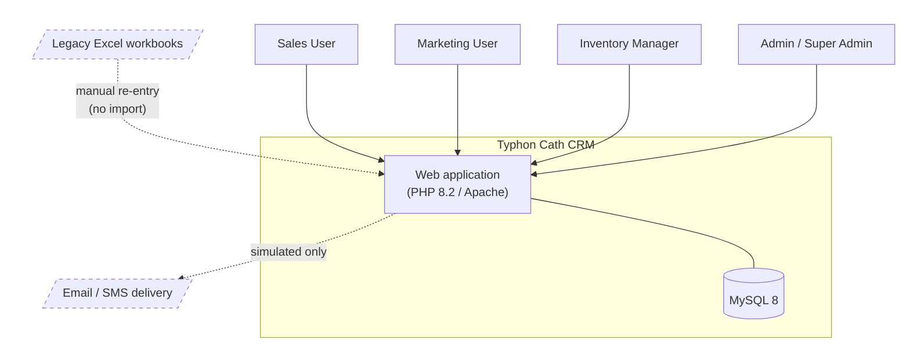

# 01 — System Context and the Legacy Excel Workflow

Diagram brief. Referenced as step 1 by `00_DIAGRAM_INDEX.md`; the file was
missing, so this restores it.

**Purpose:** show where the CRM sits relative to the people who use it and the
Excel workflow it replaces. This is the only diagram in the package that shows
the *outside* of the system — everything else looks inward.

---

## Why this diagram exists

Per `requirements_clarification.txt`, Typhon Cath ran on spreadsheets: customer
records, RFQs and quotes lived in Excel files passed between staff by email.
That is the "before" state the SRS is reacting to, and it explains several
requirements that otherwise look arbitrary:

- **Why RBAC matters.** A shared spreadsheet has no notion of who may see or
  change what. Roles exist because the file did not have any.
- **Why the pipeline is an enum, not free text.** Stage names in the sheets
  drifted ("quoted", "Quote sent", "QUOTED"), which made reporting impossible.
- **Why the dashboard is a requirement rather than a nice-to-have.** Answering
  "how many RFQs are open" previously meant opening and eyeballing a file.
- **Why one account has many contacts.** Rows conflated the company and the
  person; the clarification made the parent/child rule explicit.

## Scope boundary

**Inside:** customer/contact records, interaction logging, RFQ and quote
lifecycle, campaign definition and audience selection, product/inventory and
reservations, the dashboard, authentication and role-based access.

**Outside:** actual email or SMS delivery (simulated — see
`../KNOWN_LIMITATIONS.md`), accounting/ERP, and the Excel files themselves.
There is **no automated import** from the legacy spreadsheets; migration is
manual. That gap is deliberate to record, not an oversight in the diagram.

## Elements / Nodes

| Element | Shape | Notes |
|---------|-------|-------|
| Sales User | Actor | Customers, RFQs, quotes, reservations |
| Marketing User | Actor | Campaigns and audiences |
| Inventory Manager | Actor | Products, stock, reservations |
| Admin / Super Admin | Actor | Users and the permission matrix |
| **Typhon Cath CRM** | System boundary (box) | The subject of this package |
| MySQL database | Cylinder | Inside the boundary |
| Legacy Excel workbooks | Dashed box | External, manual, being replaced |
| Email / SMS delivery | Dashed box | External, **simulated only** |
| Web browser | Node | The single client — no native or mobile app |

## Relationships / Arrows

- Every actor → CRM, over HTTPS in a browser (label with the actor's role).
- CRM ↔ MySQL — all persistence.
- Legacy Excel → CRM, **dashed, labelled "manual re-entry (no import)"**. The
  dashed line is the point of the diagram: it is the one flow with no automation
  behind it.
- CRM → Email/SMS, **dashed, labelled "simulated"**. Nothing crosses this
  boundary at runtime.

## Mermaid starter

## Colour guidance

Follow the package convention in `00_DIAGRAM_INDEX.md`: the CRM boundary in
grey, the database as a cylinder, and every external/manual source with a dashed
border.
